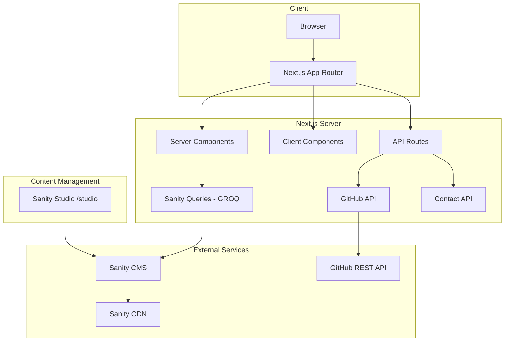

# My Portfolio — Project Documentation

> **Author:** Deni Sugiarto  
> **License:** MIT  
> **Live URL:** [denisugiarto.my.id](https://www.denisugiarto.my.id)  
> **Last Updated:** March 2026

---

## Table of Contents

- [Overview](#overview)
- [Tech Stack](#tech-stack)
- [Architecture](#architecture)
- [Directory Structure](#directory-structure)
- [App Routes](#app-routes)
- [Data Flow](#data-flow)
- [Components](#components)
- [Features](#features)
- [Sanity CMS](#sanity-cms)
- [Services Layer](#services-layer)
- [Design System](#design-system)
- [TypeScript Types](#typescript-types)
- [Configuration Files](#configuration-files)
- [Environment Variables](#environment-variables)
- [SEO & Analytics](#seo--analytics)
- [Scripts Reference](#scripts-reference)
- [Getting Started](#getting-started)

---

## Overview

A personal portfolio website built with **Next.js 15** (App Router) and **Sanity CMS** as the headless content management system. The site showcases projects, blog posts, work experience, skills, and provides a contact form — all managed through Sanity Studio at `/studio`.

### Key Features

- 🌗 **Dark / Light mode** with `next-themes` (default: dark)
- 📱 **Responsive** mobile-first design
- 📝 **Blog** with categories, tags, search, pagination, and related articles
- 💼 **Projects** showcase with gallery and tech stack
- 🧑‍💻 **Experience** timeline with detailed work history
- 📬 **Contact form** persisted to Sanity
- ⚡ **ISR** (Incremental Static Regeneration) with 1 hour revalidation
- 🔍 **SEO optimized** — meta tags, structured data, sitemap, robots.txt
- 📊 **Google Analytics** integration
- ⭐ **GitHub Stars** fetching with client + server caching

---

## Tech Stack

| Category | Technology | Version |
|---|---|---|
| **Framework** | Next.js (App Router) | 15.4.10 |
| **Language** | TypeScript | 5.5.2 |
| **UI Library** | React | 19.1.1 |
| **Styling** | Tailwind CSS | 3.3.3 |
| **Component Library** | Shadcn UI (Radix primitives) | — |
| **Animations** | Framer Motion | 11.11.11 |
| **3D** | Three.js | 0.183.2 |
| **CMS** | Sanity | 4.4.1 |
| **Data Fetching** | TanStack React Query | 5.48.0 |
| **HTTP Client** | Axios | 1.7.9 |
| **Icons** | Lucide React, Simple Icons | — |
| **Date Utils** | dayjs | 1.11.10 |
| **Markdown** | react-markdown + remark-gfm | — |
| **Code Highlighting** | react-syntax-highlighter | 15.6.1 |
| **SEO** | next-seo, next-sitemap | — |
| **Analytics** | @next/third-parties (GA) | — |
| **Theme** | next-themes | 0.3.0 |
| **Image Processing** | sharp | 0.33.1 |
| **SVG Handling** | next-plugin-svgr | 1.1.10 |
| **Bundle Analysis** | @next/bundle-analyzer | 14.0.4 |
| **Package Manager** | pnpm | — |

---

## Architecture



### Data Flow

1. **Server-side data fetching**: Pages use `async` Server Components to fetch from Sanity via GROQ queries at build/request time with ISR (`revalidate = 3600`).
2. **Client-side data fetching**: Interactive features use TanStack React Query through the `QueryProvider` wrapper.
3. **API Routes**: `/api/contact` handles form submissions; `/api/github-stars` proxies GitHub API with server-side caching.
4. **Services Layer**: Thin wrappers around Sanity query functions with error handling.
5. **CMS**: All content (blog posts, projects, experience, hero, about, skills, social links, SEO settings) is managed through Sanity Studio.

---

## Directory Structure

```
my-portfolio/
├── app/                          # Next.js App Router
│   ├── layout.tsx                # Root layout (fonts, theme, providers, GA)
│   ├── page.tsx                  # Homepage (ISR, fetches hero/projects/about)
│   ├── not-found.tsx             # Custom 404 page
│   ├── globals.css               # Design tokens, base styles, utility classes
│   ├── admin/                    # Admin pages
│   ├── api/                      # API routes
│   │   ├── contact/              # POST contact form → Sanity
│   │   └── github-stars/         # GET GitHub repo star count
│   ├── blog/                     # Blog pages
│   │   ├── page.tsx              # Blog listing page
│   │   └── [slug]/               # Dynamic blog post detail
│   ├── contact/                  # Contact page
│   ├── experience/               # Experience page
│   │   ├── page.tsx              # Experience listing (server-rendered)
│   │   ├── experience-client.tsx # Interactive timeline (client component)
│   │   └── experience-hero.tsx   # Experience page hero
│   └── projects/                 # Projects pages
│       ├── page.tsx              # Projects listing
│       └── [slug]/               # Dynamic project detail
│
├── components/                   # Shared / reusable components
│   ├── Layout/                   # App shell
│   │   ├── Layout.tsx            # Main layout wrapper
│   │   ├── Header.tsx            # Navigation header
│   │   ├── Footer.tsx            # Site footer
│   │   └── ThemeToggle.tsx       # Dark/light mode toggle
│   ├── ui/                       # Shadcn UI + custom components (19)
│   │   ├── button.tsx            # Button with CVA variants
│   │   ├── badge.tsx             # Badge component
│   │   ├── input.tsx             # Form input
│   │   ├── select.tsx            # Radix select
│   │   ├── tooltip.tsx           # Radix tooltip
│   │   ├── popover.tsx           # Radix popover
│   │   ├── pagination.tsx        # Pagination component
│   │   ├── search-input.tsx      # Search with debounce
│   │   ├── markdown.tsx          # Markdown renderer with syntax highlighting
│   │   ├── project-card.tsx      # Project card display
│   │   ├── empty-state.tsx       # Empty state placeholder
│   │   ├── loading-state.tsx     # Loading spinner/skeleton
│   │   ├── back-to-top-button.tsx
│   │   ├── form-select.tsx
│   │   ├── list.tsx
│   │   ├── simple-tooltip.tsx
│   │   ├── social-media-share-button.tsx
│   │   ├── starfall-portfolio-demo.tsx
│   │   └── starfall-portfolio-landing.tsx
│   ├── analytics/                # Google Analytics component
│   ├── providers/                # Context providers
│   ├── seo/                      # SEO components
│   ├── blog-category-nav.tsx     # Blog category navigation
│   ├── cached-inline-svg.tsx     # SVG caching utility
│   ├── contact-form.tsx          # Contact form (full)
│   ├── simple-contact-form.tsx   # Contact form (simplified)
│   ├── home-sections.tsx         # Homepage section orchestrator
│   ├── GitHubStarsWrapper.tsx    # GitHub star count display
│   ├── accessible-icon.tsx       # Accessible icon wrapper
│   ├── query-provider.tsx        # React Query provider
│   └── theme-provider.tsx        # next-themes provider
│
├── features/                     # Feature-specific components
│   ├── home/                     # Homepage sections
│   │   ├── hero.tsx              # Hero section
│   │   ├── hero-animations.tsx   # Hero animation variants
│   │   ├── about.tsx             # About section
│   │   ├── skills.tsx            # Skills showcase
│   │   ├── experience.tsx        # Experience preview
│   │   ├── projects.tsx          # Projects preview
│   │   ├── projects-animations.tsx
│   │   ├── blog.tsx              # Blog preview
│   │   └── contact.tsx           # Contact section
│   ├── blog/                     # Blog feature components
│   │   ├── blog-card-item.tsx    # Blog post card
│   │   ├── blog-list.tsx         # Blog post list
│   │   ├── blog-header.tsx       # Blog page header
│   │   ├── static-container.tsx  # Static blog rendering
│   │   ├── related-articles.tsx  # Related posts sidebar
│   │   ├── author.tsx            # Author info display
│   │   └── skeleton.tsx          # Loading skeletons
│   └── projects/                 # Project feature components
│       ├── projects-list.tsx     # Project grid/list
│       ├── projects-static-list.tsx
│       ├── project-header.tsx    # Project detail header
│       └── project-gallery.tsx   # Image gallery
│
├── lib/                          # Core utilities
│   ├── sanity.ts                 # Sanity client + TypeScript interfaces
│   ├── sanity-queries.ts         # GROQ queries (24 query functions)
│   ├── utils.ts                  # General utilities (cn helper)
│   ├── github.ts                 # GitHub API utilities
│   ├── icon-mapping.tsx          # Lucide icon name → component mapping
│   └── contrast-checker.ts       # Color contrast accessibility checker
│
├── services/                     # API service layer
│   ├── blog.ts                   # Blog data fetching
│   ├── projects.ts               # Projects data fetching
│   ├── experience.ts             # Experience data + date utilities
│   ├── contact.ts                # Contact form submission
│   ├── home.ts                   # GitHub stars (with localStorage cache)
│   └── seo.ts                    # SEO settings + structured data
│
├── sanity/                       # Sanity CMS configuration
│   └── schemas/                  # Content type schemas (13 schemas)
│       ├── index.ts              # Schema registry
│       ├── siteSettings.ts       # Global site configuration
│       ├── seoSettings.ts        # Per-page SEO settings
│       ├── heroSection.ts        # Homepage hero content
│       ├── aboutSection.ts       # About section content
│       ├── skillsSection.ts      # Skills showcase
│       ├── blogPost.ts           # Blog post schema
│       ├── blogCategory.ts       # Blog categories
│       ├── project.ts            # Portfolio project
│       ├── experience.ts         # Work experience
│       ├── technology.ts         # Tech/skills catalog
│       ├── socialLink.ts         # Social media links
│       ├── contact.ts            # Contact submissions
│       └── tag.ts                # Blog post tags
│
├── types/                        # Global TypeScript types
│   ├── index.ts                  # NavigationItem, ContactItem
│   └── blog.ts                   # Blog-specific types
│
├── hooks/                        # Custom React hooks
│   └── useDebounce.ts            # Debounce hook for search
│
├── constant/                     # Static data
│   └── data.json                 # Static configuration data
│
├── assets/                       # Design assets
├── public/                       # Static files
│   ├── img/                      # Images (17 files)
│   ├── icons/                    # Icon files (3)
│   ├── sitemap.xml               # Generated sitemap
│   ├── robots.txt                # Crawler rules
│   ├── manifest.json             # PWA manifest
│   └── favicon.ico               # + various favicon sizes
│
├── scripts/                      # Build/utility scripts
├── analyze/                      # Bundle analysis output
│
├── sanity.config.ts              # Sanity Studio configuration
├── sanity.cli.js                 # Sanity CLI config
├── next.config.mjs               # Next.js config (SVG, image domains, analyzer)
├── tailwind.config.ts            # Tailwind CSS config (design tokens)
├── tsconfig.json                 # TypeScript config
├── postcss.config.js             # PostCSS config
├── components.json               # Shadcn UI config
├── next-sitemap.config.js        # Sitemap generation config
├── .eslintrc.json                # ESLint config
├── .prettierrc                   # Prettier config
└── .npmrc                        # npm/pnpm config
```

---

## App Routes

| Route | Type | Description |
|---|---|---|
| `/` | SSG + ISR | Landing page with hero, about, skills, experience, projects, blog, and contact sections |
| `/blog` | Page | Blog listing with category filter, search, and pagination |
| `/blog/[slug]` | Dynamic | Individual blog post with related articles |
| `/projects` | Page | Projects showcase grid |
| `/projects/[slug]` | Dynamic | Individual project detail with image gallery |
| `/experience` | Page | Work experience timeline |
| `/contact` | Page | Contact page with form |
| `/admin` | Page | Admin panel |
| `/studio` | Embedded | Sanity Studio (CMS editor) |
| `/api/contact` | API | POST — submits contact form to Sanity |
| `/api/github-stars` | API | GET — returns GitHub repo star count |

---

## Components

### Layout Components (`components/Layout/`)

| Component | Purpose |
|---|---|
| `Layout.tsx` | Main page wrapper with header and footer |
| `Header.tsx` | Responsive navigation bar with mobile menu |
| `Footer.tsx` | Site footer with social links and copyright |
| `ThemeToggle.tsx` | Dark/light mode toggle switch |

### UI Components (`components/ui/`)

19 reusable UI components built on **Radix UI** primitives and styled with **Tailwind CSS** + **class-variance-authority** (CVA):

| Component | Description |
|---|---|
| `button.tsx` | Multi-variant button (CVA-based) |
| `badge.tsx` | Status/category badge |
| `input.tsx` | Form input field |
| `select.tsx` | Dropdown select (Radix) |
| `popover.tsx` | Popover overlay (Radix) |
| `tooltip.tsx` | Tooltip (Radix) |
| `simple-tooltip.tsx` | Simplified tooltip |
| `pagination.tsx` | Page pagination controls |
| `search-input.tsx` | Search input with debounce |
| `markdown.tsx` | Markdown renderer with syntax highlighting |
| `project-card.tsx` | Project showcase card |
| `form-select.tsx` | Form-integrated select |
| `list.tsx` | Styled list component |
| `empty-state.tsx` | Empty data placeholder |
| `loading-state.tsx` | Loading indicator |
| `back-to-top-button.tsx` | Scroll-to-top button |
| `social-media-share-button.tsx` | Social sharing buttons |
| `starfall-portfolio-demo.tsx` | Starfall animation demo |
| `starfall-portfolio-landing.tsx` | Starfall landing animation |

---

## Features

### Homepage (`features/home/`)

The homepage is composed of distinct sections, each as a separate component:

| Section | File | Description |
|---|---|---|
| Hero | `hero.tsx` | Headline, bio, CTAs, availability status, social links |
| Hero Animations | `hero-animations.tsx` | Framer Motion animation variants |
| About | `about.tsx` | Introduction, skills, achievements, personal info |
| Skills | `skills.tsx` | Technology/skills showcase |
| Experience | `experience.tsx` | Work experience preview (featured entries) |
| Projects | `projects.tsx` | Featured projects showcase |
| Project Animations | `projects-animations.tsx` | Project card animation variants |
| Blog | `blog.tsx` | Latest/featured blog posts |
| Contact | `contact.tsx` | Contact form section |

### Blog (`features/blog/`)

| Component | Description |
|---|---|
| `blog-card-item.tsx` | Individual blog post card with cover image, category, date |
| `blog-list.tsx` | Blog post grid/list container |
| `blog-header.tsx` | Blog page header with search/filter |
| `static-container.tsx` | Server-rendered blog content container |
| `related-articles.tsx` | Related posts recommendations |
| `author.tsx` | Author information display |
| `skeleton.tsx` | Loading skeleton placeholders |

### Projects (`features/projects/`)

| Component | Description |
|---|---|
| `projects-list.tsx` | Dynamic project grid with filters |
| `projects-static-list.tsx` | Static/server-rendered project list |
| `project-header.tsx` | Project detail page header |
| `project-gallery.tsx` | Image gallery carousel |

---

## Sanity CMS

### Configuration

- **Project ID:** `dmdxpdxy`
- **Dataset:** `production`
- **API Version:** `2024-01-01`
- **Studio Path:** `/studio`
- **Plugins:** Structure Tool, Markdown Schema

### Content Schemas (13)

#### Site Configuration

| Schema | File | Description |
|---|---|---|
| `siteSettings` | `siteSettings.ts` | Global site info, personal info, social profiles, contact settings |
| `seoSettings` | `seoSettings.ts` | Per-page SEO (meta tags, OpenGraph, Twitter Card, structured data) |

#### Content Sections

| Schema | File | Description |
|---|---|---|
| `heroSection` | `heroSection.ts` | Homepage hero (headline, bio, CTAs, availability status, technologies) |
| `aboutSection` | `aboutSection.ts` | About (intro, USP, skill categories, achievements, personal info) |
| `skillsSection` | `skillsSection.ts` | Skills showcase configuration |

#### Content Types

| Schema | File | Description |
|---|---|---|
| `blogPost` | `blogPost.ts` | Blog articles (title, slug, content, category, tags, SEO, featured flag) |
| `blogCategory` | `blogCategory.ts` | Blog categories (name, slug, color, icon) |
| `project` | `project.ts` | Portfolio projects (title, description, gallery, tech stack, links, status) |
| `experience` | `experience.ts` | Work experience (job title, company, dates, description, achievements, technologies) |
| `technology` | `technology.ts` | Technology catalog (name, category, icon, proficiency, featured) |
| `socialLink` | `socialLink.ts` | Social media links (platform, URL, visibility toggles per section) |
| `contact` | `contact.ts` | Contact form submissions |
| `tag` | `tag.ts` | Blog post tags |

### GROQ Query Functions (`lib/sanity-queries.ts`)

24 query functions for all data access needs:

| Function | Returns |
|---|---|
| `getBlogCategories()` | `BlogCategory[]` |
| `getBlogPosts(limit?)` | `BlogPost[]` |
| `getFeaturedBlogPosts()` | `BlogPost[]` |
| `getBlogPostBySlug(slug)` | `BlogPost \| null` |
| `getRelatedBlogPosts(id, tagIds, limit)` | `BlogPost[]` |
| `getProjects(limit?)` | `Project[]` |
| `getFeaturedProjects()` | `Project[]` |
| `getProjectBySlug(slug)` | `Project \| null` |
| `getSEOSettings(pageId)` | `SEOSettings \| null` |
| `submitContactMessage(message)` | `ContactMessage` |
| `getContactMessages()` | `ContactMessage[]` |
| `getExperiences()` | `Experience[]` |
| `getFeaturedExperiences()` | `Experience[]` |
| `getExperienceById(id)` | `Experience \| null` |
| `getHeroSection()` | `HeroSection \| null` |
| `getTechnologies()` | `Technology[]` |
| `getFeaturedTechnologies()` | `Technology[]` |
| `getSocialLinks()` | `SocialLink[]` |
| `getHeaderSocialLinks()` | `SocialLink[]` |
| `getFooterSocialLinks()` | `SocialLink[]` |
| `getPrimaryContactLinks()` | `SocialLink[]` |
| `getSiteSettings()` | `SiteSettings \| null` |
| `getAboutSection()` | `AboutSection \| null` |

---

## Services Layer

Thin abstraction over `sanity-queries.ts` with consistent error handling:

| Service | File | Functions |
|---|---|---|
| **Blog** | `services/blog.ts` | `fetchArticles()`, `fetchArticlesFeatured()`, `fetchArticleBySlug(slug)` |
| **Projects** | `services/projects.ts` | `fetchProjects()`, `fetchFeaturedProjects()`, `fetchProjectBySlug(slug)` |
| **Experience** | `services/experience.ts` | `fetchExperiences()`, `fetchFeaturedExperiences()`, `fetchExperienceById(id)`, `formatDateRange()`, `calculateDuration()` |
| **Contact** | `services/contact.ts` | `submitContact(formData)` |
| **Home** | `services/home.ts` | `getRepoStars()` — GitHub stars with localStorage + API caching |
| **SEO** | `services/seo.ts` | `fetchSEOSettings(pageId)`, `generateStructuredData()`, `generatePersonStructuredData()`, `generateWebSiteStructuredData()`, `generateBlogPostStructuredData()` |

---

## Design System

### CSS Architecture (`app/globals.css`)

The design system uses **CSS custom properties** (HSL colors) with Tailwind CSS, supporting light/dark themes:

#### Color Tokens

| Token | Light | Dark | Purpose |
|---|---|---|---|
| `--background` | `220 15% 97%` | `222 22% 6%` | Page background |
| `--foreground` | `222 22% 15%` | `220 15% 88%` | Body text |
| `--primary` | `220 85% 40%` | `220 70.9% 56.9%` | Primary brand color |
| `--secondary` | `220 15% 95%` | `220 8% 20%` | Secondary surfaces |
| `--accent` | `15 75% 55%` | `15 75% 60%` | Warm coral accent |
| `--muted` | `220 15% 94%` | `222 18% 12%` | Subtle backgrounds |
| `--destructive` | `0 70% 52%` | `0 70% 58%` | Error/danger |
| `--success` | `142 75% 40%` | `142 75% 45%` | Success state |
| `--warning` | `38 95% 50%` | `38 95% 56%` | Warning state |
| `--card` | `0 0% 100%` | `222 22% 8%` | Card surfaces |
| `--border` | `220 15% 85%` | `222 18% 18%` | Borders |

#### Utility Classes

| Class | Description |
|---|---|
| `.gradient-text` | Sky → Cyan → Emerald gradient text |
| `.glass-card` | Glassmorphism card with backdrop blur |
| `.glass-button` | Glass-effect interactive button |
| `.primary-button` | Gradient primary CTA button |
| `.float-animation` | Gentle vertical floating animation |
| `.divider` | Gradient horizontal divider |
| `.project-image` | Styled project image container |
| `.skill-badge` | Skill/tech badge with blur effect |

### Typography

| Font | Variable | Usage |
|---|---|---|
| **Inter** | Default body | Body text, UI elements |
| **Montserrat** | `--font-montserrat` | Display text, `.geist-font` class |
| **Suez One** | `--font-suez-one` | Section titles (`.title-section`) |

### Tailwind Config Highlights

- **Container**: Centered, responsive padding (1rem → 6rem), max 1400px
- **Border Radius**: Configurable via `--radius` (default 0.5rem)
- **Custom Animations**: `accordion-down/up`, `fade-in-down`, `spin-slow`
- **Neumorphism Shadow**: `.shadow-card` for card elements

---

## TypeScript Types

### Core Types (`lib/sanity.ts`)

All CMS data types are defined as TypeScript interfaces in `lib/sanity.ts`:

| Interface | Key Fields |
|---|---|
| `BlogPost` | title, slug, content, category, tags, publishedAt, featured, seo |
| `BlogCategory` | name, slug, color, customColor, icon |
| `Project` | title, slug, description, gallery, technologies, status, liveUrl, githubUrl |
| `Experience` | jobTitle, company, employmentType, startDate, endDate, achievements, technologies |
| `Technology` | name, category, icon, proficiencyLevel, yearsOfExperience, featured |
| `SocialLink` | platform, url, icon, visibility toggles (header/footer/hero/contact) |
| `HeroSection` | headline, subheadline, bio, primaryCTA, secondaryCTA, availabilityStatus |
| `AboutSection` | title, introduction, skillCategories, achievements, personalInfo |
| `SiteSettings` | siteInfo, personalInfo, socialLinks, contactSettings |
| `SEOSettings` | pageId, metaTitle, metaDescription, ogImage, structuredData |
| `ContactMessage` | name, email, message |
| `Tags` | name |

### Shared Types (`types/index.ts`)

| Type | Description |
|---|---|
| `NavigationItem` | `{ name, href }` — navigation link |
| `ContactItem` | `{ type, link, value }` — contact entry |

---

## Configuration Files

| File | Purpose |
|---|---|
| `next.config.mjs` | SVG plugin, bundle analyzer, remote image patterns (Sanity CDN, dev.to) |
| `tailwind.config.ts` | Design tokens, custom fonts, animations, color system, `tailwindcss-animate` |
| `sanity.config.ts` | Sanity Studio setup (project ID, dataset, plugins, basePath `/studio`) |
| `sanity.cli.js` | Sanity CLI project configuration |
| `tsconfig.json` | TypeScript config with path aliases (`@/*`) |
| `postcss.config.js` | PostCSS with Tailwind CSS and Autoprefixer |
| `components.json` | Shadcn UI configuration |
| `next-sitemap.config.js` | Auto sitemap generation on build |
| `.eslintrc.json` | ESLint with `next/core-web-vitals` |
| `.prettierrc` | Prettier formatting rules |
| `.npmrc` | pnpm configuration |

---

## Environment Variables

| Variable | Required | Description |
|---|---|---|
| `NEXT_PUBLIC_SANITY_PROJECT_ID` | ✅ | Sanity project ID |
| `NEXT_PUBLIC_SANITY_DATASET` | ✅ | Sanity dataset name (e.g., `production`) |
| `SANITY_API_TOKEN` | ⚠️ | Sanity API token (for write operations) |
| `NEXT_PUBLIC_GOOGLE_ANALYTICS` | ❌ | Google Analytics measurement ID |
| `NEXT_PUBLIC_DEV_USERNAME` | ❌ | dev.to username (blog integration) |
| `NEXT_PUBLIC_SITE_URL` | ❌ | Canonical site URL |
| `ANALYZE` | ❌ | Enable bundle analysis (`true`) |
| `NODE_ENV` | ❌ | Environment mode |

---

## SEO & Analytics

### SEO Features
- **Meta tags**: Title, description, keywords via Next.js Metadata API
- **OpenGraph**: Type, locale, URL, site name, images
- **Twitter Card**: Summary with large image
- **Structured Data**: JSON-LD for Person, WebSite, BlogPosting
- **Sitemap**: Auto-generated via `next-sitemap` on `postbuild`
- **robots.txt**: Configured for crawler access
- **Canonical URLs**: Configurable per page

### SEO Service (`services/seo.ts`)

Generates JSON-LD structured data for:
- `Person` — developer profile
- `WebSite` — site metadata with search action
- `BlogPosting` — blog articles with author, dates, images

### Analytics
- **Google Analytics** via `@next/third-parties` with Web Worker offloading
- **Resource preconnects** for `googletagmanager.com` and `google-analytics.com`

---

## Scripts Reference

| Command | Description |
|---|---|
| `pnpm dev` | Start Next.js dev server (port 3000) |
| `pnpm build` | Production build + sitemap generation |
| `pnpm start` | Start production server |
| `pnpm lint` | Run ESLint |
| `pnpm format` | Format code with Prettier |
| `pnpm analyze` | Build with bundle analyzer |
| `pnpm sanity` | Start Sanity Studio locally |
| `pnpm sanity:login` | Login to Sanity |
| `pnpm sanity:logout` | Logout from Sanity |
| `pnpm sanity:build` | Build Sanity Studio |
| `pnpm sanity:deploy` | Deploy Sanity Studio to cloud |
| `pnpm sanity:manage` | Open Sanity dashboard |
| `pnpm sanity:dataset:export` | Export dataset |
| `pnpm sanity:dataset:import` | Import dataset |

---

## Getting Started

```bash
# 1. Clone and install
git clone <repo-url>
cd my-portfolio
pnpm install

# 2. Configure environment
cp .env.example .env.local
# Edit .env.local with your Sanity project ID, dataset, and API token

# 3. Start development
pnpm dev          # Next.js on http://localhost:3000
pnpm sanity       # Sanity Studio on http://localhost:3333

# 4. Build for production
pnpm build        # Generates optimized build + sitemap
pnpm start        # Serve production build
```

### Deployment (Vercel)

1. Push to GitHub
2. Import project in Vercel
3. Add environment variables
4. Deploy — Vercel handles build + ISR automatically
